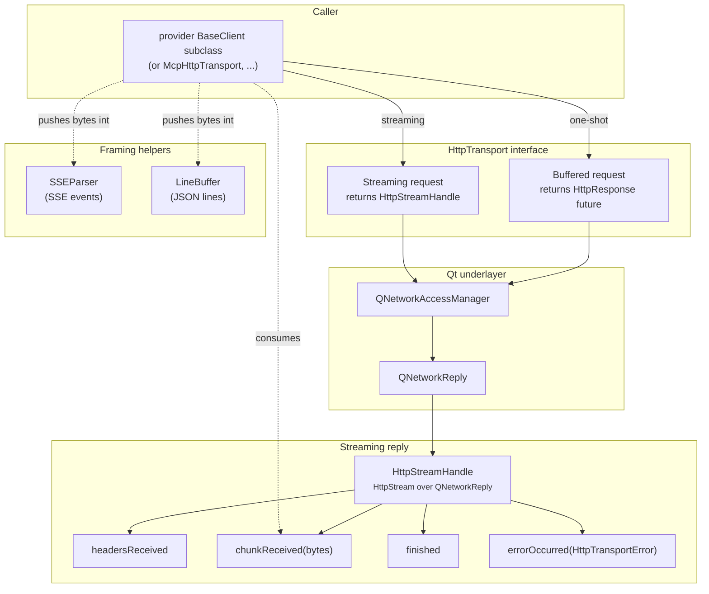

# Networking layer

Sits between provider clients and `QNetworkAccessManager`. Three goals:

1. Two shapes: buffered `HttpResponse` (one-shot) and streaming `HttpStreamHandle` (SSE).
2. Transport errors (`HttpTransportError`) vs HTTP status codes (`HttpResponse`) kept separate.
3. The two shapes are an interface (`HttpTransport`), not a class, so anything above it can be driven without a socket.

LLM-agnostic -- knows nothing about JSON, SSE events, MCP. Also backs `McpHttpTransport`.

Authentication and request headers are not part of this layer: a fully-formed `QNetworkRequest` arrives here. `BaseClient` builds it from its own `AuthScheme` and header map (see [BaseClient contract](clients/base-client.md)); `McpHttpTransport` carries its own header map. The transport just sends what it is handed.

---

## HttpTransport

The abstract seam every request passes through. It declares exactly what the layer above needs: a **buffered** send returning a future of `HttpResponse`, a **streaming** `openStream` returning an `HttpStreamHandle`, and the transfer timeout. Nothing else -- proxies, network managers, and reply objects belong to implementations.

`BaseClient` takes an `HttpTransport *` as an optional constructor argument (every provider client forwards it). A null transport means "create a private `HttpClient`"; a supplied transport stays owned by the caller. That is the only injection point -- there is no setter, so the transport cannot change under an in-flight request.

Tests use it to drive provider clients end to end without a socket: `tests/FakeHttpTransport.hpp` records the outgoing `QNetworkRequest` and body, and hands back a stream the test writes arbitrary bytes, statuses, and terminal events into.

---

## HttpClient

The production `HttpTransport`. Wraps one `QNetworkAccessManager`. Must be used from the owning thread.

The **buffered** mode returns a future that resolves to an `HttpResponse` containing the status code, headers, and body. Any HTTP status (including 4xx/5xx) produces a valid response; only transport-level failures (DNS, timeout, SSL, abort, connection refused) propagate as exceptions. This mode is used for model listing, MCP HTTP transports, and non-streamed endpoints. The **streaming** mode returns a live `HttpStream` (caller takes ownership) used for all streamed LLM requests and HTTP MCP client transport.

Additional configuration includes proxy settings (forwarded to the underlying network manager) and a transfer timeout (default 120 seconds, can be disabled).

---

## HttpStreamHandle / HttpStream

`HttpStreamHandle` is the streaming reply contract: status code and raw headers, an abort, and a fixed signal sequence -- headers-received (after which status and headers are readable), zero or more chunk-received events carrying raw bytes, and exactly one terminal event, either a clean finish or a transport error. After an abort, neither terminal event fires.

`HttpStream` is the `QNetworkReply`-backed implementation, and additionally exposes content type, single-header lookup, and completion state.

---

## SSEParser

Incremental, spec-compliant (WHATWG HTML section 9.2) Server-Sent Events parser. Accepts byte chunks and returns completed events, each carrying a type (defaulting to "message"), data (multi-line joined), and an optional ID. Supports flushing at end-of-stream, clearing between independent streams, and formatting events for the inverse direction (used by `McpHttpServerTransport`). A configurable buffer size limit (default 16 MiB) protects against memory exhaustion.

Used by all providers except Ollama.

---

## LineBuffer

Newline-framed buffer for Ollama's JSON-lines protocol. Accepts byte chunks and returns complete lines as `QByteArray`, holding any incomplete trailing bytes across calls. Intentionally separate from `SSEParser` by design.

Framing happens on bytes, never on decoded text. Both framers buffer `QByteArray` and hand raw bytes to the JSON parser, so a multi-byte UTF-8 sequence split across two network reads survives; decoding a partial chunk first would replace the split character with U+FFFD and lose it permanently.

---

## Error taxonomy

### Transport errors

`HttpTransportError` represents a transport-level failure that prevents an HTTP response from being received. It derives from `QException` and carries a human-readable message plus the underlying network error code. Transport errors cover DNS failures, timeouts, SSL errors, aborted connections, and connection refused. The dividing line between transport errors and HTTP responses is based on the network error code category -- low-level network failures are transport errors, while anything that produced an HTTP status code is delivered as an `HttpResponse`.

### HTTP error responses

Non-2xx HTTP responses are represented as normal `HttpResponse` values carrying the status code, headers, and body. Provider clients inspect these and run them through a provider-specific error parser to extract a meaningful error message. The default parser produces a message containing the HTTP status code and a truncated body snippet. Providers override this to handle their specific error envelope formats (Anthropic, OpenAI, Google, Ollama each have different shapes).
