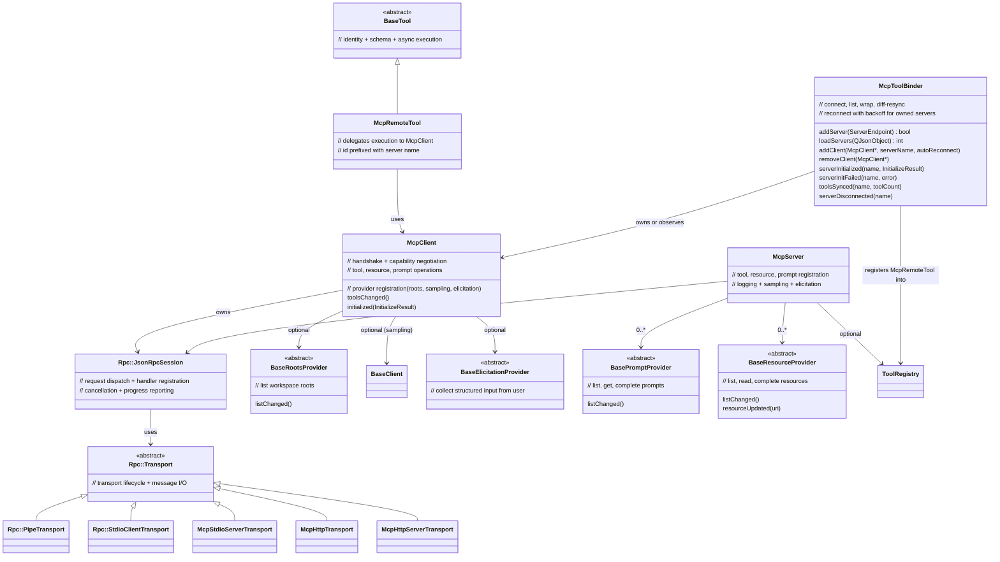

# MCP class diagram

## Ownership rules

- **`Rpc::JsonRpcSession`** — owned by `McpClient` or `McpServer`. Never outlives owner.
- **`Rpc::Transport`** — passed via constructor, NOT reparented. Caller owns lifetime.
- **`McpRemoteTool`** — parented to `ToolRegistry` (via `addTool`). Dies with registry or on `McpToolBinder` resync. Its id is `<server>_<tool>` when the binder knows the server name, so two servers exposing the same tool never collide.
- **Providers** (`BasePromptProvider`, `BaseResourceProvider`, `BaseRootsProvider`, `BaseElicitationProvider`) and sampling `BaseClient` — held as `QPointer`. Caller owns, must outlive server/client.
